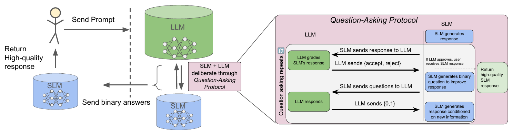
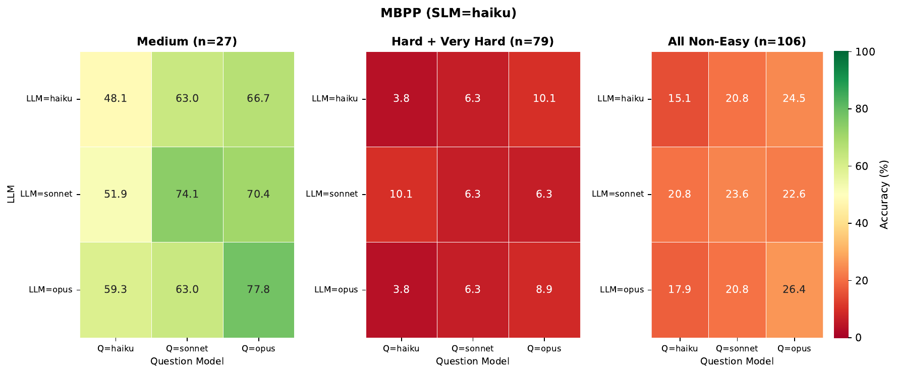
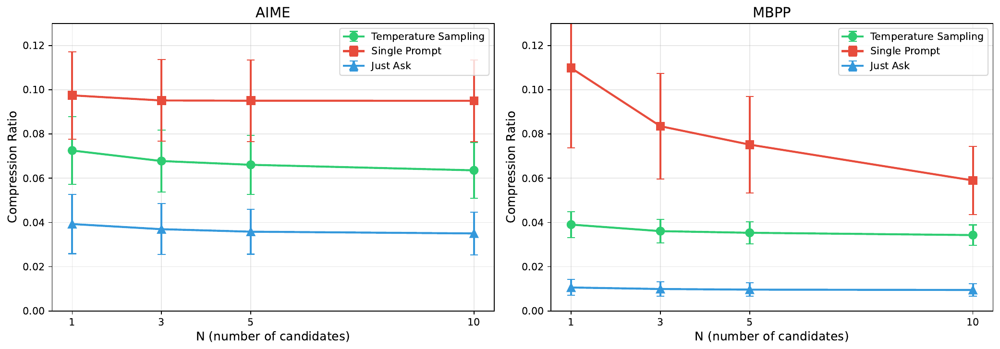

# Haiku to Opus in Just 10 Bits

Code for the paper **["Haiku to Opus in Just 10 bits: LLMs Unlock Large Compression Gains"](https://arxiv.org/abs/2604.02343)**.

> Roy Rinberg, Annabelle Michael Carrell, Simon Henniger, Nicholas Carlini, Keri Warr.
> *arXiv:2604.02343*

We study the compression of LLM-generated text across **lossless** and **lossy** regimes,
characterizing a *compression–compute frontier*: more compression is possible at the cost of
more compute. The repository implements the three methods from the paper:

1. **Question-Asking (QA) compression** — an interactive protocol inspired by *Twenty
   Questions*. A small model iteratively refines its answer by asking yes/no questions to a
   stronger model, transferring **exactly one bit per answer**. Ten binary questions recover
   **23–72%** of the small-vs-large capability gap on standard benchmarks (7–38% on harder
   ones), at compression ratios of **0.0006–0.004** — over 100× smaller than prior LLM-based
   compression (Delétang et al., 2024).
2. **Lossless compression with LoRA** — domain-adapted LoRA adapters improve LLM-based
   arithmetic coding by **~2×** over the base LLM alone.
3. **Lossy compression via succinct rewrite** — prompting a model for a shorter rewrite and
   then arithmetic-coding it reaches compression ratios of **~0.03**, a ~2× improvement over
   compressing the original response.

<p align="center">
  <br>
  <em>The compression mechanism and its use in an interactive protocol between an SLM and an LLM.</em>
</p>

## The core idea: arithmetic coding with an LLM

A language model assigns a probability distribution over the next token. Arithmetic coding uses
that distribution to encode the *actual* text in roughly `-log2(p)` bits per token, so better
predictions mean fewer bits. Everything in this repo builds on this coder.

| Component | File |
|-----------|------|
| Block-emission arithmetic coder / decoder (high-precision `Decimal`) | [`compression/block_coder.py`](compression/block_coder.py) |
| Token probability extraction (prefill + teacher-forcing) | [`compression/probability_generator.py`](compression/probability_generator.py) |
| Coder configuration (bit precision, block size, `min_prob`, …) | [`compression/compression_config.yaml`](compression/compression_config.yaml) |
| Baseline (non-LLM) coders for comparison | [`compression/utils/baseline_coders.py`](compression/utils/baseline_coders.py) |

---

## 1. Question-Asking (QA) compression

The receiver's **small** model regenerates the answer, guided only by a stream of yes/no answers
(one bit each) from the sender's **strong** model — so 10 questions ≈ 10 bits. Run across
SLM × LLM × question-model combinations on benchmarks spanning math, science, and code.

| Component | File |
|-----------|------|
| Core iterative QA protocol | [`lossy_compression/core/qa_compression.py`](lossy_compression/core/qa_compression.py) |
| Single QA-compression run | [`lossy_compression/core/run_question_answering_compression.py`](lossy_compression/core/run_question_answering_compression.py) |
| Full sweep (3×3×3 model combos per dataset) | [`lossy_compression/core/run_qa_sweep.py`](lossy_compression/core/run_qa_sweep.py) |
| Iterative variant with quality-judge early-stop | [`lossy_compression/core/run_iterative_qa_sweep.py`](lossy_compression/core/run_iterative_qa_sweep.py) |
| Benchmarks (math / science / code) | [`lossy_compression/benchmarks/`](lossy_compression/benchmarks/) — `gsm8k`, `math`, `aime`, `gpqa`, `hle`, `mbpp`, `humaneval` |
| Baseline difficulty classification | [`scripts/run_all_baselines.py`](scripts/run_all_baselines.py) |
| Variance / robustness runs | [`scripts/run_qa_variance_proper.py`](scripts/run_qa_variance_proper.py) |
| Question analysis | [`scripts/analyze_qa_questions.py`](scripts/analyze_qa_questions.py) |

```bash
python lossy_compression/core/run_qa_sweep.py --dataset gsm8k
python lossy_compression/core/run_qa_sweep.py --all
```

<p align="center">
  <br>
  <em>QA compression on MBPP (SLM = Haiku), by problem difficulty and large-model / question-model
  pairing. On Medium problems, 10 binary questions lift Haiku from ~48% to ~78% accuracy.</em>
</p>

### 🎮 Interactive demo

The **[`QA-compression-webapp-demo/`](QA-compression-webapp-demo/)** submodule is a small web app
that lets you play Question-Asking compression live (a Twenty-Questions–style interface between a
small and a large model). It deploys to Vercel; see the submodule's `deploy.sh`.

```bash
git submodule update --init   # fetch the demo
```

## 2. Lossless compression + LoRA

Compress text exactly using an LLM's next-token probabilities, then specialize the model to a
domain with a LoRA adapter so its predictions sharpen and the encoded text shrinks (~2×). A RAG
router selects which domain adapter to apply per input. Trained adapters and topic clusters are
released on [Hugging Face](https://huggingface.co/datasets/royrin/model-compression).

Overall compression ratio on LMSYS-Chat (lower is better):

| Method | Compression ratio | vs. base model |
|--------|:-----------------:|:--------------:|
| Gzip (post-tokenization) | 0.77 | — |
| Base model (no LoRA) | 0.18 | 1.0× |
| **Correct LoRA** | **0.09** | **2.0×** |
| Average *wrong* LoRA | 0.13 | 1.4× |
| RAG-routed LoRA (prompt only) | 0.10 | 1.9× |

| Step | What it does | Where |
|------|--------------|-------|
| Build a compression dataset | UltraChat/LMSYS prompts + model completions | [`scripts/generate_compression_dataset.py`](scripts/generate_compression_dataset.py) |
| Measure compression (base model **or** `+LoRA`) | bits/token over a dataset, with plots | [`scripts/measure_compression.py`](scripts/measure_compression.py) |
| Cluster a corpus into domains | text / chat clustering for per-domain adapters | [`scripts/lora/cluster_text_datasets.py`](scripts/lora/cluster_text_datasets.py), [`cluster_chat_datasets.py`](scripts/lora/cluster_chat_datasets.py) |
| Train per-cluster LoRA adapters | one adapter per domain shard | [`scripts/lora/train_lora_cluster.py`](scripts/lora/train_lora_cluster.py) (`train_lora_array.sbatch`, `train_lora_qwen3.sbatch`) |
| Route to the right adapter (RAG) | FAISS index + nearest-cluster selection | [`scripts/lora/lora_router.py`](scripts/lora/lora_router.py), [`LORA/build_rag.py`](LORA/build_rag.py), `scripts/lora/build_lora_index.sbatch` |
| Evaluate LoRA compression | correct-vs-wrong adapter, RAG, cascade selection | [`scripts/lora/evaluate_lora_compression.py`](scripts/lora/evaluate_lora_compression.py), [`evaluate_rag_lora.py`](scripts/lora/evaluate_rag_lora.py), [`evaluate_rag_routing_strategies.py`](scripts/lora/evaluate_rag_routing_strategies.py), [`evaluate_cascade_lora_selection.py`](scripts/lora/evaluate_cascade_lora_selection.py) |
| Tabulate results | compression tables for the paper | [`scripts/lora/print_compression_table.py`](scripts/lora/print_compression_table.py) |

```bash
# Compress a dataset with a base model (short alias or full HF name)
python scripts/measure_compression.py 8b data/compression_dataset_20251113_235553.yaml

# RAG-routed LoRA compression
python scripts/lora/evaluate_rag_lora.py --help
```

## 3. Lossy compression via succinct rewrite

Instead of sending the exact response, ask the model for the shortest rewrite that still lets a
reader recover the answer, then arithmetic-code that rewrite (compression ratio ~0.03).

| Component | File |
|-----------|------|
| Succinct-rewrite ("just ask") experiment | [`lossy_compression/core/request_based_compression_experiment.py`](lossy_compression/core/request_based_compression_experiment.py) |
| Just-ask + best-of-N | [`lossy_compression/core/just_ask_best_of_n_experiment.py`](lossy_compression/core/just_ask_best_of_n_experiment.py) |
| Best-of-N selection (unified) | [`lossy_compression/core/run_best_of_n_unified.py`](lossy_compression/core/run_best_of_n_unified.py) |
| Compression helpers (`compress_text`, model loading) | [`lossy_compression/core/lossy_compression_tools.py`](lossy_compression/core/lossy_compression_tools.py) |
| Plots | [`plot_request_based_results.py`](lossy_compression/core/plot_request_based_results.py), [`plot_best_of_n_results.py`](lossy_compression/core/plot_best_of_n_results.py) |

<p align="center">
  <br>
  <em>Compression ratio vs. number of candidates N on AIME (left) and MBPP (right) with Opus.
  "Just Ask" (succinct rewrite) roughly halves the ratio versus shortest-of-N methods. Lower is better.</em>
</p>

---

## Repository layout

```
compression/          Core arithmetic coding (block coder, probability generator)
LORA/ , scripts/lora/ LoRA training, RAG routing, and LoRA-compression evaluation
lossy_compression/    Question-Asking (QA), lossy rewrite, and best-of-N compression
  ├── core/           Method implementations + sweeps + plotting
  └── benchmarks/     Per-benchmark baselines and QA-compression evaluators
scripts/              Dataset generation, baselines, plotting, utilities
data/                 Small example compression datasets
assets/               Figures used in this README
utils/                LLM API wrappers and cost tracking
```

## Setup

```bash
# Python environment (uses uv + pyproject.toml / uv.lock)
uv sync
source source.sh            # activates .venv

# Fetch the demo submodule
git submodule update --init
```

**API keys.** API-backed runs read keys from a gitignored `SECRETS/` directory (see
[`utils/llm_api.py`](utils/llm_api.py)):

```
SECRETS/anthropic.key
SECRETS/openai.key
SECRETS/openrouter__mats.key   # optional, for OpenRouter models
```

For local model runs, copy `.env.example` → `.env` and set your Hugging Face / Torch cache paths.

## Citation

```bibtex
@article{rinberg2026haiku,
  title   = {Haiku to Opus in Just 10 bits: LLMs Unlock Large Compression Gains},
  author  = {Rinberg, Roy and Carrell, Annabelle Michael and Henniger, Simon and Carlini, Nicholas and Warr, Keri},
  journal = {arXiv preprint arXiv:2604.02343},
  year    = {2026},
  url     = {https://arxiv.org/abs/2604.02343}
}
```
